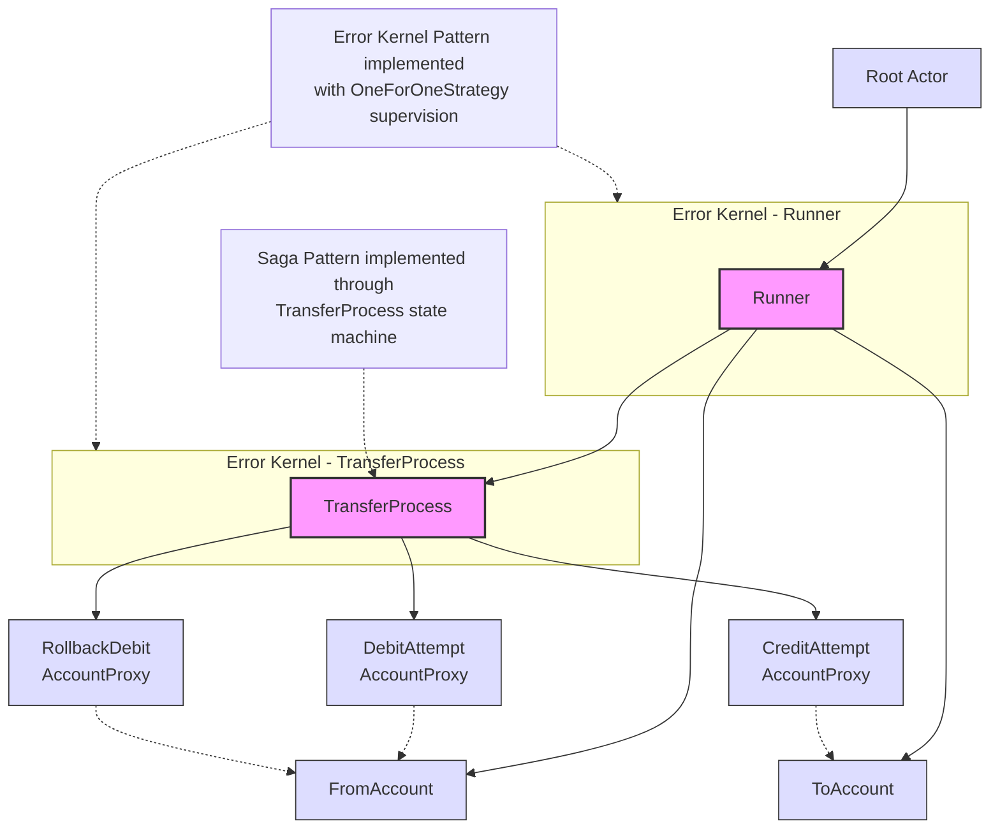

# phluxor-saga-example / Money Transfer Saga

This example demonstrates how to implement a money transfer saga using Phluxor.

## Protocol Buffers 

```bash
$ protoc -I=./vendor/phluxor/phluxor/protobuf/ --proto_path=protobuf --php_out=src protobuf/*.proto
```

## Actor Hierarchy in Phluxor Saga Example

This diagram shows the actor hierarchy in the Phluxor Saga Example project, which implements the Saga pattern using an Actor model toolkit in PHP.



## Explanation

1. **Root Actor**: The system's root actor that spawns the Runner actor.

2. **Runner**: Orchestrates the transfer process by creating Account actors and TransferProcess actors.

3. **Account Actors**: Represent bank accounts with balance operations (credit/debit).

4. **TransferProcess**: Implements the Saga pattern as a state machine with the following states:
    - Starting
    - Awaiting Debit Confirmation
    - Awaiting Credit Confirmation
    - Rolling Back Debit (compensation)

5. **AccountProxy Actors**: Mediate communication between TransferProcess and Account actors:
    - DebitAttempt: Attempts to debit the source account
    - CreditAttempt: Attempts to credit the destination account
    - RollbackDebit: Compensating action to rollback a debit if credit fails

6. **Error Kernel Pattern**: Implemented through supervision strategies:
    - Runner uses OneForOneStrategy to supervise TransferProcess actors
    - TransferProcess uses OneForOneStrategy to supervise AccountProxy actors
    - This creates a hierarchy where errors are contained and handled at appropriate levels

The system demonstrates a Saga pattern implementation where a distributed transaction (money transfer) is broken down into a sequence of local transactions with compensating actions for failure scenarios.
