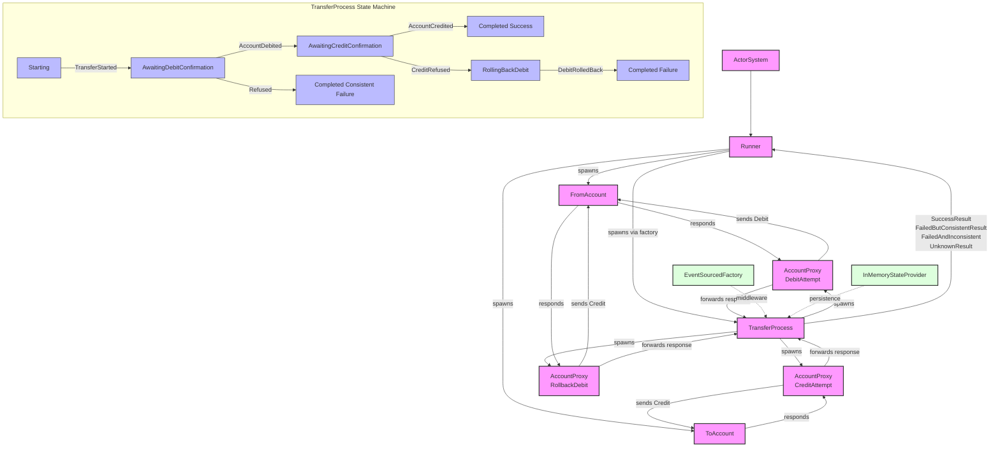
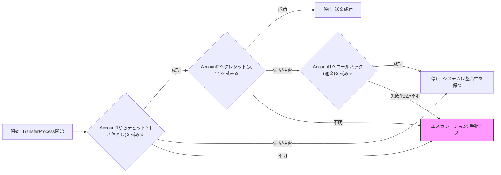

# Phluxor Saga Pattern Actor Relationships

```mermaid
graph TD
    %% Main Actor System
    AS[ActorSystem] --> R[Runner]
    
    %% Runner creates accounts and transfer processes
    R -->|spawns| A1[FromAccount]
    R -->|spawns| A2[ToAccount]
    R -->|spawns via factory| TP[TransferProcess]
    
    %% TransferProcess creates proxy actors
    TP -->|spawns| AP1[AccountProxy\nDebitAttempt]
    TP -->|spawns| AP2[AccountProxy\nCreditAttempt]
    TP -->|spawns| AP3[AccountProxy\nRollbackDebit]
    
    %% Proxies communicate with accounts
    AP1 -->|sends Debit| A1
    AP2 -->|sends Credit| A2
    AP3 -->|sends Credit| A1
    
    %% Communication back to parent
    A1 -->|responds| AP1
    A2 -->|responds| AP2
    A1 -->|responds| AP3
    
    AP1 -->|forwards response| TP
    AP2 -->|forwards response| TP
    AP3 -->|forwards response| TP
    
    %% Results back to Runner
    TP -->|SuccessResult\nFailedButConsistentResult\nFailedAndInconsistent\nUnknownResult| R
    
    %% Event Sourcing
    ESF[EventSourcedFactory] -.->|middleware| TP
    IMSP[InMemoryStateProvider] -.->|persistence| TP
    
    %% State transitions in TransferProcess
    subgraph "TransferProcess State Machine"
        S1[Starting] -->|TransferStarted| S2[AwaitingDebitConfirmation]
        S2 -->|AccountDebited| S3[AwaitingCreditConfirmation]
        S3 -->|AccountCredited| S4[Completed Success]
        S3 -->|CreditRefused| S5[RollingBackDebit]
        S5 -->|DebitRolledBack| S6[Completed Failure]
        S2 -->|Refused| S7[Completed Consistent Failure]
    end
    
    %% Legend
    classDef actor fill:#f9f,stroke:#333,stroke-width:2px
    classDef state fill:#bbf,stroke:#333,stroke-width:1px
    classDef system fill:#dfd,stroke:#333,stroke-width:2px
    
    class AS,R,A1,A2,TP,AP1,AP2,AP3 actor
    class S1,S2,S3,S4,S5,S6,S7 state
    class ESF,IMSP system
```

## Flow

```mermaid

graph LR
    A[開始: TransferProcess開始] --> B{"Account1からデビット(引き落とし)を試みる"};
    B -- 成功 --> C{"Account2へクレジット(入金)を試みる"};
    B -- 失敗/拒否 --> E[停止: システムは整合性を保つ];
    B -- 不明 --> F[エスカレーション: 手動介入];
    C -- 成功 --> D[停止: 送金成功];
    C -- 失敗/拒否 --> G{"Account1へロールバック(返金)を試みる"};
    C -- 不明 --> F[エスカレーション: 手動介入];
    G -- 成功 --> E[停止: システムは整合性を保つ];
    G -- 失敗/拒否/不明 --> F[エスカレーション: 手動介入];
    style F fill:#f9f,stroke:#333,stroke-width:2px

```
